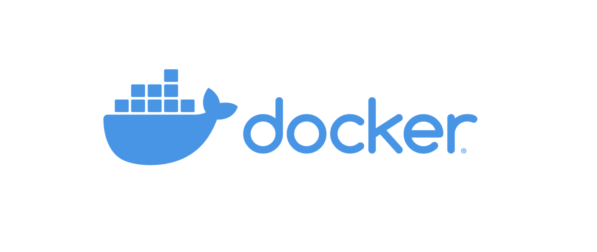

## 이미지, 컨테이너, 볼륨

### 이미지

이미지는 컨테이너를 생성하고 실행할 때 읽기 전용으로 사용되며, 어떠한 경우에도 **생성된 이미지는 변경되지 않는다.** 이미지의 이름은 기본적으로 [저장소 이름]/[이미지 이름]:[태그]의 형태로 구성된다. 태그는 버전 관리에 사용된다.

### 컨테이너

이미지로 컨테이너를 생성할 수 있다. 이미지로 컨테이너를 생성하면 해당 이미지의 목적에 맞는 파일이 들어 있는 파일 시스템과 격리된 시스템 자원 및 네트워크를 사용할 수 있는 **독립적인 공간**이 생성되는데 이게 바로 도커 컨테이너다. 컨테이너는 이미지를 읽기 전용으로만 사용하고 이미지에서 변경된 사항만 컨테이너 계층에 저장하기 때문에, 이미지는 컨테이너에서 무엇을 하든지 영향을 받지 않는다. 또한 하나의 이미지로 여러개의 컨테이너를 만들 수 있으며 각각의 컨테이너는 독립된 공간에 존재하기 때문에 특정 컨테이너를 조작하더라도 나머지 컨테이너에는 변화가 없다.

```
$ docker create -i -t --name mycentos centos:7

$ docker start mycentos

$ docker attach mycentos
```

docker create [이미지 이름] 명령어로 컨테이너를 생성할 수 있다. -i -t 옵션은 컨테이너와 상호 입출력을 가능하게 하며, --name 옵션으로 해당 컨테이너의 이름을 설정할 수 있다. docker start는 컨테이너를 시작하게 하고, docker attach는 컨테이너 내부로 들어가도록 한다. docker run [이미지 이름] 명령어로 컨테이너를 생성함과 동시에 시작하고 내부로 들어가게 할 수도 있다. docker rm [컨테이너 이름] 명령어로 컨테이너를 삭제할 수 있다. [도커 기본 명령어 모음](https://velog.io/@wlsdud2194/-Docker-%EB%8F%84%EC%BB%A4-%EA%B8%B0%EB%B3%B8-%EB%AA%85%EB%A0%B9%EC%96%B4-%EB%AA%A8%EC%9D%8C)

### 컨테이너 내부의 데이터를 보존하는 방법

컨테이너가 삭제되면 컨테이너 계층에 저장된 정보도 모두 삭제되는데, 컨테이너의 **데이터를 영속적으로 활용하기 위해** 볼륨을 활용할 수 있다. 볼륨을 활용하는 방법은 여러가지가 있다. 호스트와 볼륨을 공유할 수도 있고, 볼륨 컨테이너를 활용할 수도 있으며, 도커가 관리하는 볼륨을 생성할 수도 있다.

### 호스트 볼륨 공유

```
$ docker run -d \
--name wordpressdb_hostvolume \
-e MYSQL_ROOT_PASSWORD=password \
-e MYSQL_DATABASE=wordpress \
-v /home/wordpress_db:/var/lib/mysql \
mysql:5.7

$ docker run -d \
-e WORDPRESS_DB_PASSWORD=password \
--name wordpress_hostvolume \
--link wordpressdb_hostvolume:mysql \
-p 80 \
wordpress
```

-v [호스트의 공유 디렉토리]:[컨테이너의 공유 디렉토리] 형태로 입력해 호스트의 디렉토리와 컨테이너의 디렉토리를 공유한다. 컨테이너의 해당 디렉토리에 수정사항이 발생하면 공유한 호스트 디렉토리에 반영되므로, 해당 컨테이너를 삭제한다고 해도 호스트에 데이터가 남아있게 된다. 만약 호스트 디렉토리와 컨테이너 디렉토리 각각에 데이터가 존재하는 상태로 둘을 공유한다면 호스트 디렉토리가 컨테이너 디렉토리를 덮어쓰게 된다.

### 볼륨 컨테이너

--volumes-from 옵션으로 -v 옵션을 적용한 컨테이너의 볼륨 디렉토리를 다른 컨테이너가 다시 공유받을 수 있다. 여러개의 컨테이너가 동일한 컨테이너에 --volumes-from 옵션을 사용해 볼륨을 공유받을 수도 있는데, 이를 활용해 별도의 역할은 하지 않고 '볼륨 컨테이너'로만 사용되는 컨테이너를 만들어 활용할 수도 있다.

### 도커 볼륨

도커 자체에서 제공하는 docker volume 명령어로 볼륨을 생성할 수도 있다.

```
$ docker volume create --name myvolume

$ docker run -i -t --name myvolume_1 \
-v myvolume:/root/ \
ubuntu:14.04
```

도커 볼륨은 volume create 명령어로 생성할 수 있다. 여러 종류의 스토리지를 쓸 수 있지만 기본적으로는 로컬 호스트에 저장되며, 이 때 저장되는 위치는 도커가 알아서 지정하므로 사용자가 따로 고려할 필요가 없다. 컨테이너에서 -v 옵션을 입력할 때는 [볼륨의 이름]:[컨테이너의 공유 디렉토리] 형식을 따른다. 컨테이너를 생성하고 -v 옵션을 입력할 때 볼륨의 이름을 따로 입력하지 않으면 해당 디렉토리에 해당하는 볼륨을 자동으로 생성하는데, 생성 후에 어떤 볼륨을 사용하는지 알고싶으면 docker container inspect [컨테이너 이름] 명령어를 사용하면 된다. 또한 docker volume prune 명령어로 사용되지 않는 볼륨을 한꺼번에 삭제할 수 있다.

## 이미지 생성, 추출

### 이미지 생성

```
$ docker run -i -t --name commit_test ubuntu:14.04

$ docker commit \
-a 'jeno' -m 'first commit' \
commit_test \
commit_test:first
```

docker commit 명령어로 컨테이너를 이미지로 만들 수 있다. commit 명령어는 docker commit [OPTIONS] CONTAINER [REPOSITORY[:TAG]] 형식을 따른다. 옵션에 있는 -a는 author를 뜻하고, -m은 commit의 message를 뜻한다. commit 명령어로 이미지를 생성하면 컨테이너에서 변경된 사항뿐만 아니라 컨테이너가 생성될 때 설정된 detached 모드, 컨테이너 커맨드와 같은 컨테이너의 설정들도 모두 이미지에 함께 저장된다.

### 이미지 추출

```
$ docker save -o ubuntu_14_04.tar commit_test
```

만들어진 도커 이미지를 옮기기 위해 별도로 저장하려면 docker save 명령어를 사용한다. docker save 명령어를 사용하면 컨테이너의 커맨드, 이미지 이름과 태그 등 이미지의 모든 메타데이터를 포함해 하나의 파일로 추출할 수 있다. -o 옵션에는 추출될 파일명을 입력한다.

추출된 이미지는 load 명령어로 도커에 다시 로드할 수 있다. save 명령어로 추출된 이미지는 이미지의 모든 메타데이터를 포함하므로 load로 이미지를 로드하면 이전의 이미지와 완전히 동일한 이미지가 생성된다. save, load와 비슷한 명령어로 export, import가 있는데, export 명령어는 컨테이너의 파일시스템을 tar로 추출하면서 컨테이너 및 이미지에 대한 설정 정보는 저장하지 않는다.