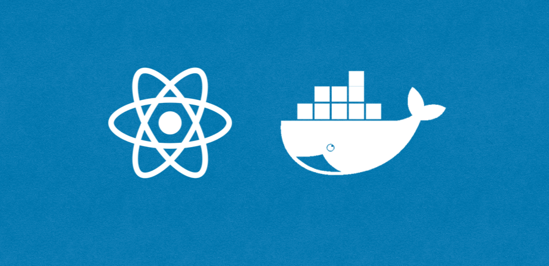

Dockerfile과 Docker Compose를 이용해 도커로 리액트 앱을 배포해보자.

### Dockerfile

개발한 애플리케이션을 컨테이너로 만들어 이미지를 생성하기 위해서는 [앞선 글](/docker-이미지-컨테이너-볼륨)처럼 베이스가 되는 이미지로 컨테이너를 만들고, 그 위에 환경을 세팅한 뒤, 이미지를 commit해야 한다. 이는 패키지를 설치하고 소스코드를 가져오는 등의 작업을 일일히 수작업으로 해줘야 한다는 불편함이 있다. 이러한 작업을 간편하게 할 수 있도록 도커는 Dockerfile을 읽어 이미지를 생성하는 build 명령어를 제공한다.

Dockerfile에는 컨테이너에서 수행해야 할 작업을 명시해둔다. 작성된 한 줄이 하나의 명령어가 되며 명령어를 명시한 뒤 옵션을 추가하는 방식이다. [Dockerfile에서 자주 쓰이는 명령어](https://www.daleseo.com/dockerfile/)

### Docker Compose

도커 컴포즈는 컨테이너의 설정이 정의된 YAML 파일을 읽어 도커 엔진을 통해 컨테이너 생성을 돕는다. 간단하게 말하면 앞서 장황하게 커맨드로 적어왔던 CLI를 문서로 작성해 한번에 실행할 수 있게 하는 것이다. [도커 컴포즈를 활용하여 완벽한 개발 환경 구성하기](https://www.44bits.io/ko/post/almost-perfect-development-environment-with-docker-and-docker-compose)

자세한건 직접 실습을 하면서 살펴보자.

### CRA로 프로젝트 생성

우선 배포할 리액트 앱을 CRA로 간단하게 생성한다.

```
$ npx create-react-app react-sample
```

### Dockerfile 생성

프로젝트의 root에 Dockerfile을 만든다. 파일 내부는 다음과 같다.

```
FROM node:12-alpine

WORKDIR /app

COPY package*.json .
RUN npm install
COPY . .

CMD ["npm", "start"]
```

node:12-alpine 이미지를 베이스로 한다. 그리고 WORKDIR을 /app으로 설정한다. 워킹 디렉토리 내부로 package.json과 lock 파일을 복사한 뒤, 그 안에서 npm install한다. 모듈이 모두 설치되면 나머지 파일들을 모두 워킹 디렉토리로 복사하고 npm start한다.

필요에 따라 .dockerignore 파일을 생성해 이미지 생성시 제외할 폴더를 지정할 수도 있다.

### docker-compose.yml 생성

프로젝트의 root에 docker-compose.yml을 만든다. 파일 내부는 다음과 같다.

```
version: "3"

services:
  frontend:
    container_name: react-sample
    build:
      context: .
      dockerfile: Dockerfile
    volumes:
      - ".:/app"
      - "/app/node_modules"
    ports:
      - "3001:3000"
```

이는 아래와 같은 CLI를 3점대 최신버전의 컴포즈로 변환한 것이라 할 수 있다.

```
$ docker run -v /app/node_modules -v $(pwd):/app -p 3001:3000 
```

그리고 다음 명령어를 입력해 도커 컴포즈로 이미지를 빌드한다.

```
$ docker-compose up -d --build
```

up -d는 백그라운드에 서비스 실행 후 빠져나온다는 의미이고, --build는 서비스 시작 전에 이미지를 새로 만든다는 의미이다. 이제 localhost:3001로 가보자. 정상적으로 리액트 앱이 컨테이너에서 실행되는 것을 확인할 수 있을 것이다.