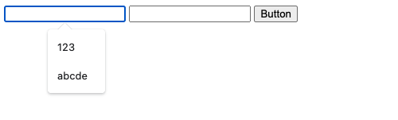
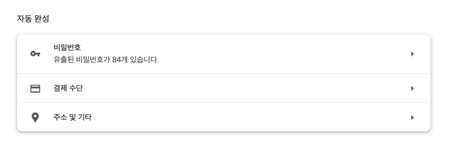
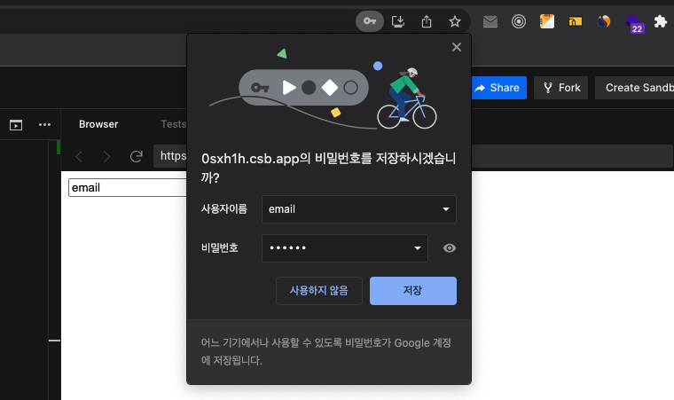

프론트엔드 개발을 하다보면 따로 설정을 한 적이 없는데도 인풋에 자동완성이 걸리는 경우가 있다. 또는 자동완성이 됐으면 좋겠는데도 내 마음처럼 잘 안 되는 경우도 있다. 심지어 [WHATWG HTML 표준](https://html.spec.whatwg.org/#autofill)을 읽어도 잘 이해가 안 되고, 특히 SPA의 경우에는 더 모호해진다. 직접 한 번 이것저것 테스트를 해봐야겠다.

#### Environment

- chrome 101.0.4951.64
- react 17.0.2
- react-router-dom 5.2.0

#### Chrome 자동완성 설정



우선 Chrome의 [자동완성 설정 페이지](chrome://settings/autofill)를 먼저 확인하자. 당연히 각 자동완성 항목을 켜둬야 동작한다. 특히 주소 및 기타를 켜둬야 배너에 나온 것과 같은 일반적인 자동완성 목록을 볼 수 있다. 우선 테스트를 위해 모두 켜두도록 하자.

#### 사전 지식

input과 textarea 태그에는 `autocomplete`라는 attribute가 있다. 기본적으로 브라우저에서는 이 autocomplete 값을 보고 자동완성할 항목을 구분한다. 만약 autocomplete 값이 없거나 값이 `on`일 때는 `name`으로 구분한다. (기본 값은 on이다.)

```js
// first-name을 key로 자동완성 값을 저장한다.
<input type="text" name="name" autocomplete="first-name" />
```

### 저장 테스트

#### path 이동이 없을 경우

조직 입력 후에 로그인을 한다고 생각해보자. 굳이 path 이동이 필요 없을 경우에는 아래와 같이 처리하게 될 것이다. 이 때 조직 인풋을 자동완성으로 저장하고 싶다면 어떻게 해야할까?

```js
const App = () => {
  const [isLoginStep, setIsLoginStep] = useState(false);

  if (isLoginStep) return <LoginPage />;
  else return <OrgPage setIsLoginStep={setIsLoginStep} />;
};
```

일반적으로는 아래와 같이 페이지 인풋과 버튼을 두고 이동할 것이다.

```js
const OrgPage = ({ setIsLoginStep }) => {
  const handleClickButton = () => {
    setIsLoginStep(true);
  };

  return (
    <div>
      <input type="text" name="org" />
      <button onClick={handleClickButton}>Button</button>
    </div>
  );
};
```

하지만 이렇게만 하면 저장이 안된다. 기본적으로 Chrome의 자동완성은 path 이동을 기반으로 한다. path를 이동해야 입력이 정상적으로 됐다고 판단하고 저장하는 것이다. 그렇다면 이 경우에는 어떻게 저장할 수 있을까?

```js {7-10}
const OrgPage = ({ setIsLoginStep }) => {
  const handleClickButton = () => {
    setIsLoginStep(true);
  };

  return (
    <form onSubmit={handleClickButton}>
      <input type="text" name="org" />
      <button type="submit">Button</button>
    </form>
  );
};
```

form으로 submit하면 된다. 원래는 form submit은 막지(preventDefault) 않는다면 reload 하기 때문에 path 이동과 동일하게 동작하는 것으로 보인다. 그렇다면 로그인 페이지에서 비밀번호를 저장하는 로직도 동일할까?

```js {7-11}
const LoginPage = ({ setIsLoginStep }) => {
  const handleClickButton = () => {
    setIsLoginStep(false);
  };

  return (
    <div>
      <input type="text" name="email" />
      <input type="password" name="password" />
      <button onClick={handleClickButton}>Button</button>
    </div>
  );
};
```

동일하지 않다. 설정에서도 볼 수 있었지만, 기본적으로 Chrome에서 비밀번호를 저장하는 것과 그 외 값을 저장하는 것은 저장하는 곳도 다르고 방식도 다르다. type이 password인 인풋이 존재하면 Chrome은 눈을 시퍼렇게 뜨고 쳐다보다가 거기에 사용자가 입력하면 비밀번호 저장할래? 알려준다. 아래와 같이 말이다.



여기서 저장 버튼을 누르면 비밀번호 저장 내역에서 볼 수 있다. 만약 비밀번호 저장이 아닌 일반 자동완성을 원한다면 마찬가지로 form으로 감싸주고 submit하면 된다. 물론 이때 비밀번호 인풋은 submit을 하더라도 자동완성에는 저장되지 않는다. 그리고 만약 자동완성과 비밀번호 저장이 한 인풋에 동시에 존재할 경우에는 비밀번호 저장내역을 먼저 보여준다.

#### path를 이동할 경우

state로 분기 처리하는 것이 아니라 path를 이동하면 어떻게 될까? 코드는 아래와 같을 것이다.

```js
const App = () => {
  return (
    <Switch>
      <Route path="/login">
        <LoginPage />
      </Route>
      <Route path="/">
        <OrgPage />
      </Route>
    </Switch>
  );
};
```

로그인 페이지는 어차피 동일할테니 조직 페이지만 한 번 살펴보자.

```js {9-12}
const OrgPage = () => {
  const navigate = useNavigate();

  const handleClickButton = () => {
    navigate("/login");
  };

  return (
    <div>
      <input type="text" name="org" />
      <button onClick={handleClickButton}>Button</button>
    </div>
  );
};
```

위 코드로도 잘 될까? 잘 된다. form으로 감싸지 않더라도 path를 이동하기 때문에 자동으로 저장하는 것이다. 결국 path를 이동하던지 form으로 감싸서 submit하던지 둘 중의 하나는 해야 저장이 되는 것으로 추론해볼 수 있다.

그렇다면 저장을 막고 싶으면 어떻게 해야 할까?

### 저장 막기 테스트

저장을 막는 건 간단하다. autocomplete 속성에 off를 주면 된다. new-password, one-time-code도 off와 동일하다는 글도 봤는데, 테스트해본 결과로는 이 값도 동일하게 해당 key로 저장이 된다. 막으려면 off를 사용하자.

```js {10}
const OrgPage = () => {
  const navigate = useNavigate();

  const handleClickButton = () => {
    navigate("/login");
  };

  return (
    <div>
      <input type="text" name="org" autoComplete="off" />
      <button onClick={handleClickButton}>Button</button>
    </div>
  );
};
```

### 결론

- 비밀번호 자동완성과 일반 자동완성은 저장하는 방식이 다르다.
- 비밀번호 자동완성은 type이 password인 input을 Chrome이 지켜보다 저장 여부를 물어본다.
- 비밀번호 외의 자동완성은 path를 이동하거나 form을 submit할 때 저장된다.
- 저장을 막으려면 autocomplete를 off로 처리하자.